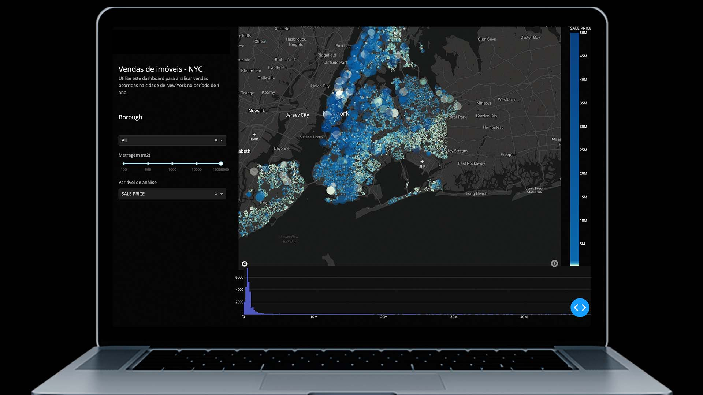

# Real Estate Analyzer
Este é um dashboard desenvolvido apenas em Python, para análise de vendas no mercado imobiliário de Nova Iorque. Para a criação do mapa, usamos a API do Mapbox.

## 🔧 Funções

- Apresenta todas as transações de imóveis em Nova Iorque entre 2016 e 2017
- Obter a localização dos imóveis por ordem de preço
- Filtrar os imóveis no mapa a partir do seu tamanho

## 👨‍💻 Tecnologias Utilizadas

Utilizando apenas **PYTHON** e as bibliotecas:
> - Dash
> - Dash Core Components
> - Plotly
> - Requests
> - Pandas 
> - NumPy

## ⚙ Configuração para rodar o projeto

### Antes de qualquer coisa, será necessario ter as seguintes ferramentas.

* Um editor de texto, recomento utilizar o VisualStudio Code (VsCode).
* Python 3.11.0

  ## **Agora vamos iniciar a configuração do projeto.**

> ps. Para o passo a passo abaixo, utilizarei a configuração no windows utilizando o Vscode.

**1. Criação de um ambiente virtual: Utilizarei o terminal do Bash dentro do VsCode. Mas o processo será o mesmo em outros terminais, mudando apenas os comandos.**

* primeiro instale a biblioteca virtualenv no seu computador, utilizando o comando `pip install virtualenv`
* execute o comando `python3 -m venv "nome_da_env"`
* após a criação do ambiente virtual (env), inicie o mesmo, com o comando `source "nome_da_env"/Scripts/activate`, observe que no terminal abaixo dos comandos ira aparecer o nome da sua env, como a imagem abaixo.(no meu caso o nome da env é "env" mesmo)
  
  

**2.  Agora iremos realizar a instalação das Bibliotecas, com a env ativa, execute os comandos abaixo.**

* `pip install -r requirements.txt` para realizar a instalação das bibliotes.
*  O comando acima irá baixar todas as bibliotecas necessárias para rodar o projeto.
  
**3. Agore que ja instalou as bibliotecas, vamos rodar o projeto**

* Ainda no terminal com a env ativa, execute o comando `python index.py`.
* Esse comando ira executar o script e ira retornar um link localhost.
* Segure a tecla Ctrl e clique no link para abrir no navegador, e estará pronto.

  

